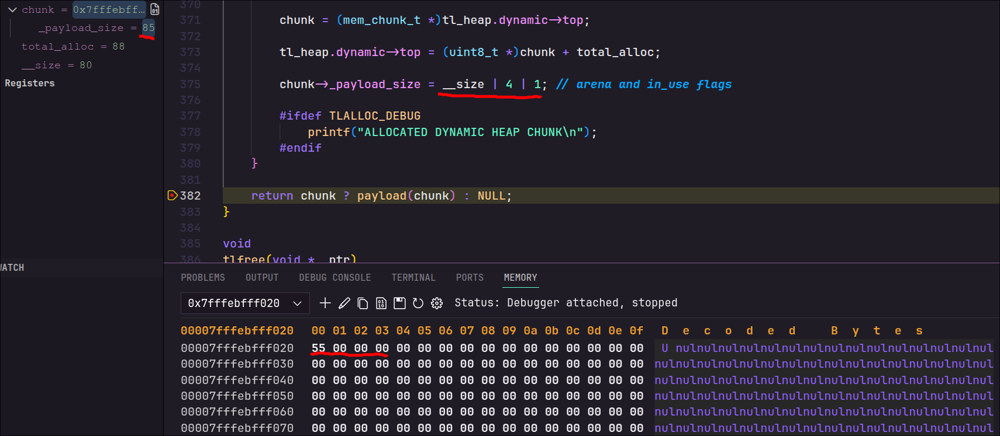
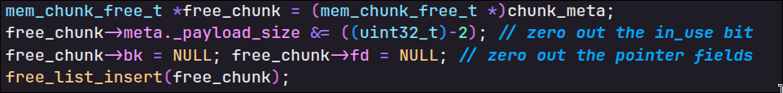

# Custom Memory Allocators in C

Simple memory allocators for research and learning purposes
---

## Allocators

### 1. Chunk Allocator
GLIBC Inspired, focusing on thread local heaps, and on minimizing external fragmentation.
* Uses `brk` for the main thread's data segment and `mmap` for secondary thread heaps.
* Provides each thread with its own heap managed via `mmap`.
* Implements chunk splitting and coalescing (merging) to maintain a compact heap.

### 2. Arena Allocator
Basic faster allocations, works similar to a regular stack
* Uses `mmap` for allocations
* Supports both random and user-defined alignment (similar to aligned_alloc())
---

## How to run

### Requirements
- C compiler (GCC or Clang)
- CMake 3.10 or newer
- Linux or Unix-like operating system (uses `brk` and `mmap`)

### Build steps
In the chosen allocator directory run:

```sh
mkdir build
cd build
cmake ..
cmake --build .
```

Than run the binary in the build file.

## Bonus implementation details

### 1. Chunk metadata flags
Each chunk size is aligned to 8Bytes - that means 3 lowest bits are free and can be used to store flags. That trick was found on mallocinternals
Allocation sets (changes if reused) the 3 lowest bits to correct flags
To read the actual size, program has to ignore the 3LSBs
  ```sh
  actual_size = size & ~7
  ```
<br>



In the picture, 80 Byte-payload chunk was allocated. Actual reserved space is 88 Bytes (additional metadata).
We set the in_use flag and the allocated_arena flag (as this is a dynamically allocated heap).
The payload size is 80 (0x50), and the flags add to 85 (0x55).

<br>

Currently used flags are mmaped, and in_use - for free behavior

### 2. Free chunk space
To ensure no wasted space for additional metadata, free chunks additional pointers (to form a linked list) are stored over the payload



Simple cast makes it so no additional data is allocated over existing chunk

For this to be possible however, program has to ensure payload is big enough to handle additional data - via min chunk size


